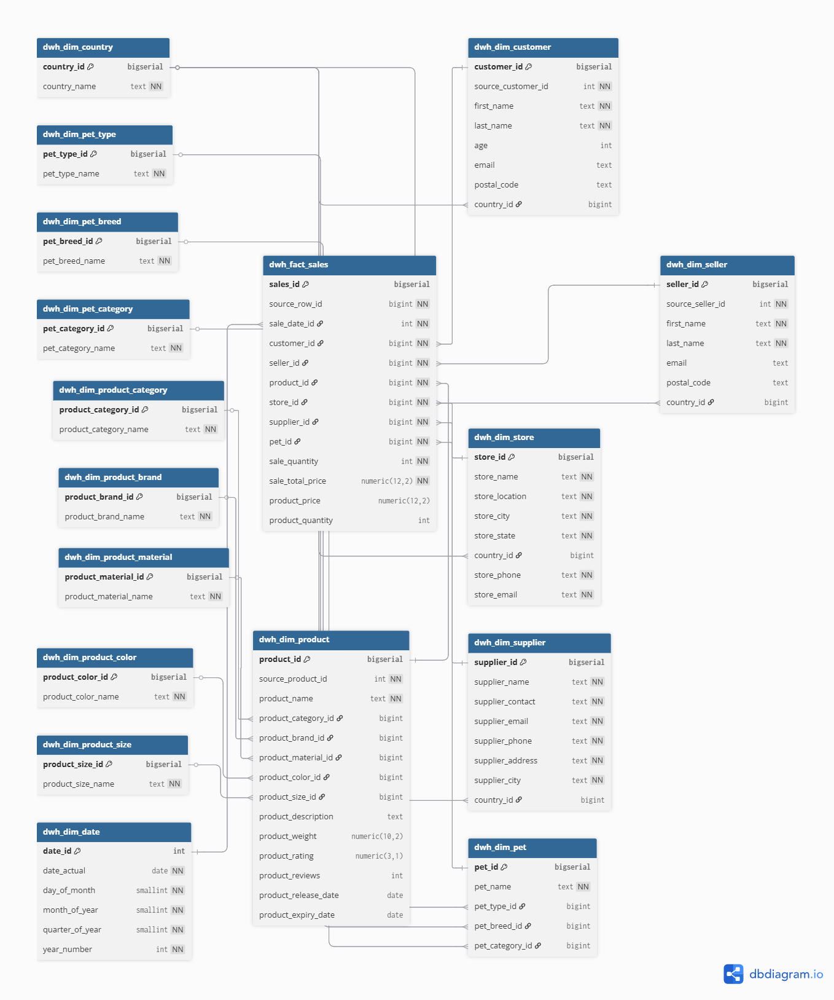

# BigDataSnowflake

Лабораторная работа: трансформация исходных CSV в модель данных Snowflake

## Схема



## Что в проекте

- `исходные данные/` - 10 CSV-файлов по 1000 строк.
- `docker-compose.yml` - запуск PostgreSQL.
- `sql/init/01_create_staging.sql` - создание staging-таблицы.
- `sql/init/02_load_staging.sql` - загрузка CSV в staging.
- `sql/init/03_create_dwh.sql` - DDL измерений и факта.
- `sql/init/04_load_dwh.sql` - DML заполнение DWH.

## Запуск

```bash
docker compose up -d
```

## Подключение к БД

- host: `localhost`
- port: `5432`
- database: `pet_store_dw`
- user: `postgres`
- password: `postgres`
